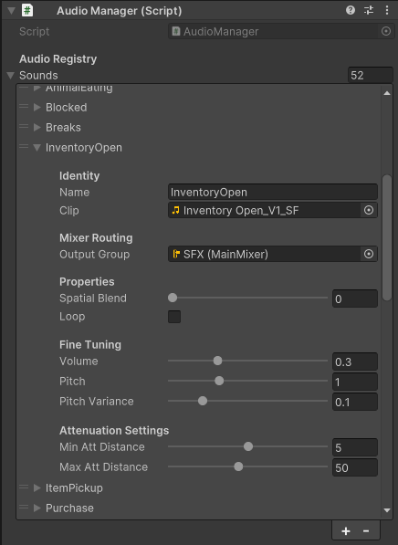

[⬅️ Back to Portfolio](./)

# SpellCatcher
### Lead Systems & Gameplay Engineer
*15-Person Capstone Team (SkuppyWuppies) | Unity (C#) | Published on Steam*


**Role:** Lead Engineer (Sub-team Lead of 3 Engineers)

**Deliverables:** UI/UX Architecture, Custom Audio Pipeline & Tooling, Movement Controller, Steam Release Packaging

**Links:**
[Steam Store Page](https://store.steampowered.com/app/4551940/SpellCatcher/) | [Gameplay Trailer / Demo](https://youtu.be/0Kv8YTDxORs?si=TRYRSPAZV_7cTwtr)

---

## 🏗️ 1. UI/UX Architecture & Dynamic Data Systems
*Refactoring the front-end interface into an event-driven, decoupled presentation layer.*

* **Dynamic Spell Hotbar:** Engineered a responsive UI manager featuring an interpolated sliding indicator following active selection, dynamic rune counts, and real-time icon updates tied to player inventory state.
* **Codex Encyclopedia System:** Architected a modular creature encyclopedia utilizing instantiated button prefabs, dynamic scroll view data binding, and clean state toggles to prevent UI softlocks.
* **State Interrupt Handling:** Implemented logic to cleanly interrupt active spell casts, preventing spell execution desyncs during menu or inventory transitions.
* **Full Menu UI Systems:** Coordinated with 2D artist to make Main Menu, Settings Menu, and Pause Menus, all with dedicated artwork, buttons, and configurable keybinds.

<figure style="text-align: center;">
  
  <figcaption><i>The Unity interface for the AudioManager.</i></figcaption>
</figure>

TODO: INSERT VIDEO OF CHANGING SPELLS AND INVENTORY SLOTS WITH ITEMS IN THEM
---

## 🛠️ 2. Custom Audio Pipeline & Automation Tooling
*Building spatial audio systems and custom production utilities.*

* **Spatial Audio Engine:** Integrated dynamic audio management featuring 3D spatial positioning, loop control, and pitch variance for spell-casting, creature capture sequences, and environment interactions.
* **`AudioScanner.py` Pipeline Tool:** Developed an independent Python automation utility that parsed the entire C# codebase, cross-referencing registered audio metadata against active script invocations to identify orphaned clips and missing sound registrations.
* **Contextual Feedback:** Implemented surface-aware kinematic sound triggers (e.g., differentiated landing audio based on ground vs. water collision) and proximity-based audio triggers with variable attenuation.

---

## 🏃 3. First-Person Kinematics & Major Mechanic Systems
*Implementing many major gameplay systems, refining the feel of movement, interactions, and spell-casting.*

* **Player Controller:** Built a comprehensive player controller (~500 lines of code) with 27 public variables exposed to designers and 20 internal private variables for tracking and mutating player state.
* **Interactable Raycast Dispatcher:** Built dynamic screen prompts displaying contextual action text based on raycast hit detection against interactive world objects.
* **Player Inventory System:** Built a flexible inventory system to allow for any inventory system to be used by the designers: one with four rigid slots like *Slime Rancher* or an inventory like *Minecraft*, with global stack sizes that can be overridden on a per-item basis.

```cs
// NOTE: [Attributes] show in Unity Inspector; // comments show in IDE for variable descriptions
[Header("Air Control")]
[Tooltip("\"Walk\" speed while in the air.")]
public float airWalkSpeed = 12f; // walk speed while in the air
[Tooltip("\"Sprint\" speed while in the air.")]
public float airSprintSpeed = 24f; // sprint speed while in the air
[Range(0f, 1f)]
[Tooltip("How much control the player has over movement while in the air. 0 = no control, 1 = full control.")]
public float airControl = 0.5f; // how much control the player has over movement while in the air (0 = none, 1 = full)
[Tooltip("Whether to allow the player to \"sprint\" while in the air.")]
public bool allowAirSprinting = true; // whether to allow the player to sprint while in the air
[Tooltip("Whether air movement should use acceleration/deceleration smoothing. If FALSE, air movement will be snappier.")]
public bool allowAirAcceleration = true; // whether to allow the player to accelerate while in the air
```

---

## 🚢 4. Release Engineering & Team Stewardship
*Managing repository stability, scene recovery, and Steam deployment.*

* **Build Master:** Managed builds during the entire project development cycle, with naming and versioning, and uploaded to a shareable drive so teammates could always access recent builds and for use in playtests, and ultimately for deployment to Steam.
* **Merge Conflict & Scene Recovery:** Resolved critical Git merge conflicts across Unity scene YAML files and vertical-slice data, restoring lost work by hand.
* **Code Architecture & Styles:** Established project hierarchies across all disciplines; provided naming schema for whole team to follow for ease in searching and storing assets; encouraged the use of specific coding styles and design patterns.
