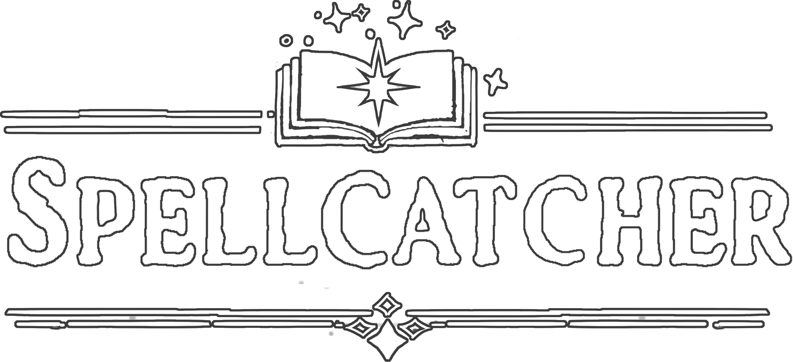
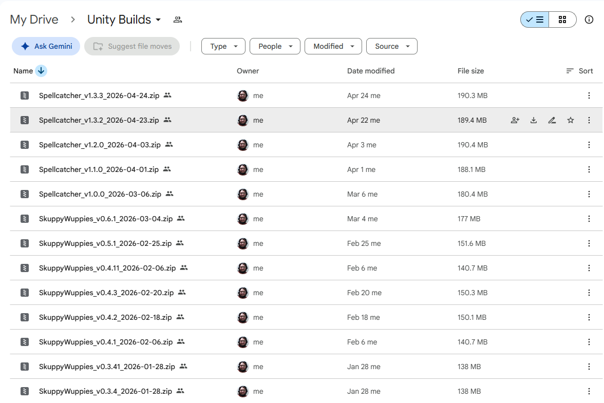
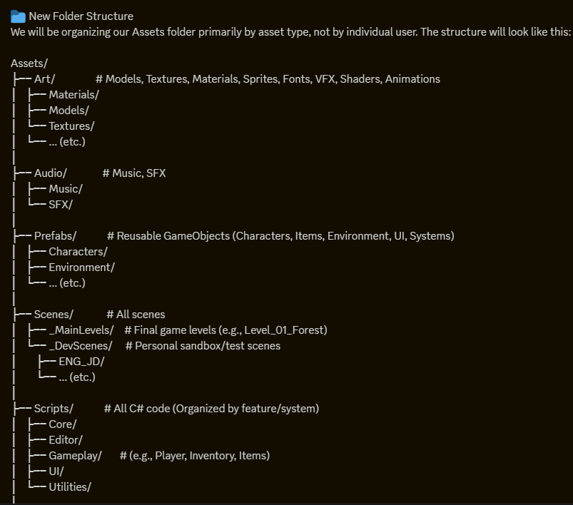

<style>
  /* 1. Page Width & Base Typography */
  body {
    background-color: #16181d !important;
    color: #c9d1d9 !important;
    font-family: -apple-system, BlinkMacSystemFont, "Segoe UI", Helvetica, Arial, sans-serif !important;
    line-height: 1.6 !important;
    max-width: 1020px !important;
    margin: 40px auto !important;
    padding: 0 32px !important;
  }

  /* 2. Top Navigation Pill Badges */
  .nav-pills {
    margin: 16px 0 24px 0 !important;
  }
  .nav-pills a {
    display: inline-block !important;
    padding: 5px 14px !important;
    background: #21262d !important;
    color: #58a6ff !important;
    border: 1px solid #30363d !important;
    border-radius: 20px !important;
    font-size: 0.9rem !important;
    font-weight: 500 !important;
    margin-right: 8px !important;
    margin-bottom: 8px !important;
    text-decoration: none !important;
  }
  .nav-pills a:hover {
    background: #30363d !important;
    border-color: #8b949e !important;
    text-decoration: none !important;
  }

  /* 3. Distinct Headers & Dividers */
  h1, h2, h3, h4 { 
    font-weight: 600 !important; 
  }
  h1 { 
    color: #f0f6fc !important; 
    border-bottom: 1px solid #30363d; 
    padding-bottom: 8px; 
  }
  h2 { 
    color: #f0f6fc !important; 
    font-size: 1.6rem !important;
    margin-top: 36px !important;
  }
  h3 { 
    color: #79c0ff !important; 
    font-size: 1.35rem !important;
    border-left: 4px solid #1f6feb;
    padding-left: 10px;
    margin-top: 28px !important;
  }
  hr { 
    border: 0; 
    border-top: 1px solid #30363d; 
    margin: 36px 0; 
  }

  /* 4. Links */
  a { 
    color: #58a6ff !important; 
    text-decoration: none !important; 
  }
  a:hover { 
    text-decoration: underline !important; 
  }

  /* 5. Snug, Dark Tables (Hugs content instead of full-width stretch) */
  table {
    width: auto !important;
    display: inline-table !important;
    background-color: #21262d !important;
    border: 1px solid #30363d !important;
    border-radius: 6px !important;
    border-collapse: separate !important;
    border-spacing: 0 !important;
    overflow: hidden !important;
    margin: 16px 0 !important;
  }
  table tr, table tr:nth-child(2n) {
    background-color: #21262d !important;
    border: none !important;
  }
  table td, table th {
    background-color: #21262d !important;
    border: 1px solid #30363d !important;
    color: #c9d1d9 !important;
    padding: 6px 14px !important;
  }
  table td a {
    font-weight: 600 !important;
  }

  /* 6. Code & Media */
  code, pre {
    background-color: #1f242c !important;
    color: #e6edf3 !important;
    border: 1px solid #30363d !important;
    border-radius: 6px !important;
  }
  img, video, iframe {
    border-radius: 8px;
    border: 1px solid #30363d;
    max-width: 100%;
  }
  figcaption {
    color: #8b949e !important;
    font-size: 0.85rem !important;
    margin-top: 6px !important;
  }
</style>

[⬅️ Back to Portfolio](./)

# SpellCatcher
### Lead Systems & Gameplay Engineer
*15-Person Capstone Team (SkuppyWuppies) | Unity (C#) | Published on Steam*


**Role:** Lead Engineer (Sub-team Lead of 3 Engineers)

**Deliverables:** UI/UX Architecture, Custom Audio Pipeline & Tooling, Movement Controller, Steam Release Packaging

**Links:**

[Steam Store Page](https://store.steampowered.com/app/4551940/SpellCatcher/) | [Gameplay Trailer / Demo](https://youtu.be/0Kv8YTDxORs?si=TRYRSPAZV_7cTwtr)

---

## 🏗️ 1. UI/UX Architecture & Dynamic Data Systems
*Refactoring the front-end interface into an event-driven, decoupled presentation layer.*

* **Dynamic Spell Hotbar:** Engineered a responsive UI manager featuring an interpolated sliding indicator following active selection, dynamic rune counts, and real-time icon updates tied to player inventory state.
* **Codex Encyclopedia System:** Architected a modular creature encyclopedia utilizing instantiated button prefabs, dynamic scroll view data binding, and clean state toggles to prevent UI softlocks.
* **State Interrupt Handling:** Implemented logic to cleanly interrupt active spell casts, preventing spell execution desyncs during menu or inventory transitions.
* **Full Menu UI Systems:** Collaborated with the 2D art team to integrate custom sprite sheets, modular button prefabs, and dynamic navigation bindings across Main, Pause, and Settings menus.

<p align="center">
  <video width="80%" style="border-radius: 6px;" autoplay loop muted playsinline>
    <source src="./img/ui_demo.mp4" type="video/mp4">
    Your browser does not support the video tag.
  </video>
</p>

---

## 🛠️ 2. Custom Audio Pipeline & Automation Tooling
*Building spatial audio systems and custom production utilities.*

* **Spatial Audio Engine:** Integrated dynamic audio management featuring 3D spatial positioning, loop control, and pitch variance for spell-casting, creature capture sequences, and environment interactions.
* **`AudioScanner.py` Pipeline Tool:** Developed an independent Python automation utility that parsed the entire C# codebase, cross-referencing registered audio metadata against active script invocations to identify orphaned clips and missing sound registrations.
* **Contextual Feedback:** Implemented surface-aware kinematic sound triggers (e.g., differentiated landing audio based on ground vs. water collision) and proximity-based audio triggers with variable attenuation.

<figure style="text-align: center;">
  
  <figcaption><i>Custom Unity inspector interface exposing spatial blend curves, pitch variance, and distance attentuation parameters to sound designers.</i></figcaption>
</figure>

---

## 🏃 3. First-Person Kinematics & Major Mechanic Systems
*Implementing many major gameplay systems, refining the feel of movement, interactions, and spell-casting.*

* **Player Controller:** Built a comprehensive player controller (~500 lines of code) with 27 public variables exposed to designers and 20 internal private variables for tracking and mutating player state.
* **Interactable Raycast Dispatcher:** Built dynamic screen prompts displaying contextual action text based on raycast hit detection against interactive world objects.
* **Player Inventory System:** Built a flexible inventory system to allow for any inventory system to be used by the designers: one with four rigid slots like *Slime Rancher* or an inventory like *Minecraft*, with global stack sizes that can be overridden on a per-item basis.

```cs
// NOTE: [Attributes] show in Unity Inspector; // comments show in IDE for variable descriptions
[Header("Air Control")]
[Tooltip("\"Walk\" speed while in the air.")]
public float airWalkSpeed = 12f; // walk speed while in the air
[Tooltip("\"Sprint\" speed while in the air.")]
public float airSprintSpeed = 24f; // sprint speed while in the air
[Range(0f, 1f)]
[Tooltip("How much control the player has over movement while in the air. 0 = no control, 1 = full control.")]
public float airControl = 0.5f; // how much control the player has over movement while in the air (0 = none, 1 = full)
[Tooltip("Whether to allow the player to \"sprint\" while in the air.")]
public bool allowAirSprinting = true; // whether to allow the player to sprint while in the air
[Tooltip("Whether air movement should use acceleration/deceleration smoothing. If FALSE, air movement will be snappier.")]
public bool allowAirAcceleration = true; // whether to allow the player to accelerate while in the air
```

---

## 🚢 4. Release Engineering & Team Stewardship
*Managing repository stability, scene recovery, and Steam deployment.*

* **Build Master:** Served as Build Master across the full development cycle: managed semantic versioning, maintained internal distribution pipelines for playtesting, and packaged gold master builds for Steamworks deployment.
* **Merge Conflict & Scene Recovery:** Resolved critical Git merge conflicts across Unity scene YAML files and vertical-slice data, restoring lost work by hand.
* **Code Architecture & Styles:** Established project hierarchies across all disciplines; provided naming schema for whole team to follow for ease in searching and storing assets; encouraged the use of specific coding styles and design patterns.

<div style="display: flex; gap: 16px; justify-content: center; align-items: flex-start; margin: 20px 0;">
  <figure style="flex: 1; text-align: center; margin: 0;">
    
    <figcaption style="margin-top: 8px;"><i>Internal build archive tracking semantic versioning and milestone releases across development.</i></figcaption>
  </figure>
  <figure style="flex: 1; text-align: center; margin: 0;">
    
    <figcaption style="margin-top: 8px;"><i>Asset hierarchy standards established and communicated to maintain repository hygiene across all 15 contributors.</i></figcaption>
  </figure>
</div>
