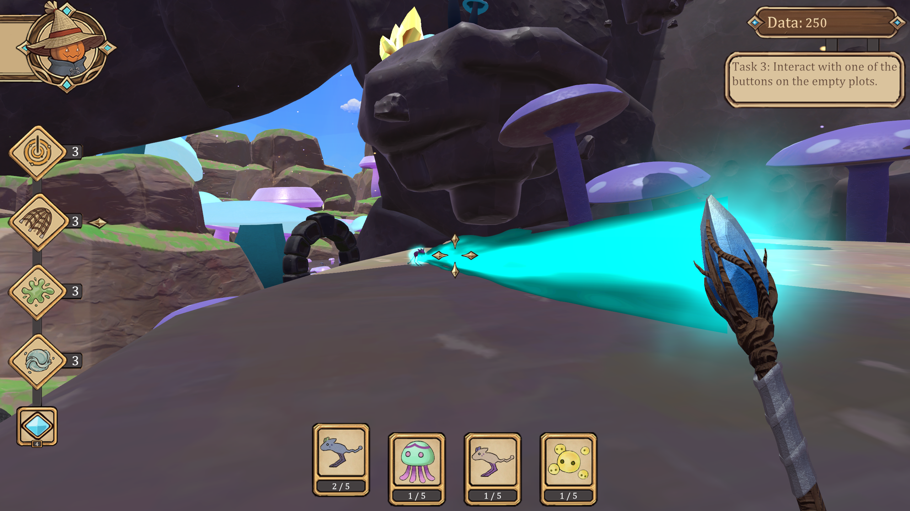

<base target="_blank">

# Portfolio
### Engineer: Software | Graphics | Games
[📄 Resume (PDF)](./Resume_Jonathan_Draney.pdf) | [GitHub](https://github.com/jondra-dev) | [LinkedIn](https://www.linkedin.com/in/jonathan-draney-715733430/) | [Email](mailto:jonathandraney@outlook.com)

---

## Featured Projects

### [SHADER: Simple Hardware-Accelerated Deferred Engine and Renderer](./shader.md)
*A custom C++/OpenGL graphics engine designed to contrast deferred and forward shading under dynamic lighting stress tests.*

  

* **Architecture:** Built a multi-target G-Buffer (Position, Normals, packed Albedo + Specular) to decouple geometric rendering from screen-space lighting math.
* **Lighting Systems:** Distance-attenuated dynamic point lights with inverse-square falloff, randomized motion behaviors, and procedural spawning.
* **Stress Benchmarking:** Procedural $7\times7\times7$ teapot cube ($343$ meshes) with $1,500$ concurrent dynamic lights demonstrating real-time overdraw elimination.
* **Tech Stack:** C++, OpenGL, GLSL, GLEW, FreeGLUT

👉 **[Read Full Architecture Breakdown & Watch Demo ➔](./shader.md)** |

---

### [Spellcatcher: Systems & Gameplay Engineering](./capstone.md)
*First-person creature collection adventure published on Steam, developed by a 15-person interdisciplinary team in Unity (C#).*

  

* **Engineering Leadership:** Led a 3-engineer sub-team, managed repository branch integrity, resolved complex YAML merge conflicts, and packaged releases for Steam.
* **UI/UX Architecture:** Engineered a decoupled hotbar manager with animated selection tracking, inventory data binding, and state-interruption safety to prevent softlocks.
* **Custom External Tooling:** Created `AudioScanner.py`, an automated Python audit utility that parsed the C# codebase to detect unregistered and orphaned audio assets.
* **Gameplay & Kinematics:** Designed a 50-parameter first-person movement controller, raycast interaction dispatcher, and flexible designer-facing inventory mechanic systems.

👉 **[Read Systems Breakdown & Implementation Details ➔](./capstone.md)** | **[Steam Store Page](https://store.steampowered.com/app/4551940/SpellCatcher/)**

---

## Technical Skills

**Languages:**
* C, C++, C#, Java, Python
* JavaScript, SQL, Bash, Kotlin, Rust, Go

**Engines & Graphics:**
* Unity (2022.3 LTS, 6), Unreal Engine 5, OpenGL, GLSL

**Development Tools & Workflows:**
* Git, GitHub, Visual Studio, VS Code, Emacs, Linux / WSL
