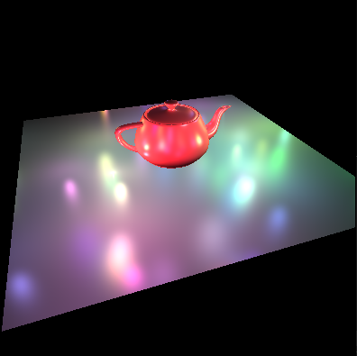
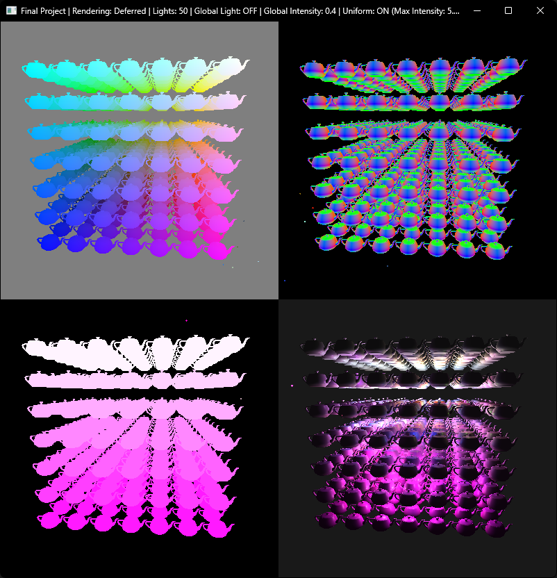
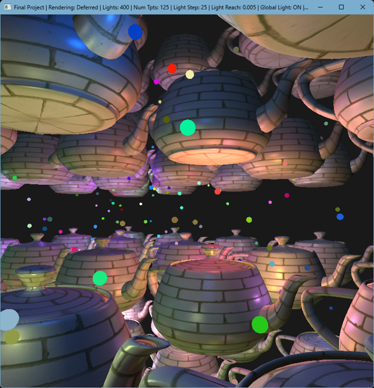

[⬅️ Back to Portfolio](./)

# SHADER: Simple Hardware Accelerated Deferred Engine and Renderer
*Interactive Computer Graphics Capstone / Final Project*

**Tech Stack:** C++ | OpenGL | GLSL | GLEW | FreeGLUT  
**Codebase Scale:** ~2,000 lines of C++ architecture, ~250 lines of custom GLSL shaders

<figure style="text-align: center;">
  
  <figcaption><i>A teapot model on a plane with colored lights.</i></figcaption>
</figure> 

---

<iframe
  width="100%"
  height="450"
  src="https://www.youtube-nocookie.com/embed/Cnc0-1fAuSU"
  title="SHADER Demo Recording"
  frameborder="0"
  allow="accelerometer; autoplay; clipboard-write; encrypted-media; gyroscope; picture-in-picture"
  allowfullscreen>
</iframe>

---

## 🎯 What to Look For in the Demo
* **Dynamic Point Light Scaling:** Spawning, managing, and distance-attenuating hundreds of individual point lights using the inverse-square law.
* **Animated Light Behaviors:** Custom motion paths including orbital ("solar") systems and clustered ("beehive") flitting patterns for the single teapot and teapot cube scenes, respectively.
* **Continuous Scene Rotation:** Stress-testing hardware rasterization and culling across changing viewing angles, and clearing contrasting render pipeline performance.
* **G-Buffer Diagnostic View:** Live 4-quadrant split showing internal render targets and final composited image.
* **The Procedural Teapot Cube:** Scalable geometric grids generating high vertex counts (combined with many lights) to push rendering stress tests.
* **Live Pipeline Toggle:** Real-time switching between Forward and Deferred pipelines to contrast hardware execution under load.

---

## 🧠 Architecture: Forward vs. Deferred Shading

The core objective of SHADER was to build and benchmark a **deferred rendering pipeline** against a traditional **forward rendering pipeline** under heavy dynamic lighting loads.

<figure style="text-align: center;">
  
  <figcaption><i>G-Buffer Quadrant Diagnostic: Position (Top-Left), Surface Normals (Top-Right), Packed Albedo + Specular (Bottom-Left), Final Shaded Composite (Bottom-Right).</i></figcaption>
</figure>

### The Problem: Forward Rendering & Overdraw
In a traditional forward pipeline, lighting calculations are evaluated for **every fragment generated by every piece of geometry**, regardless of whether that fragment will actually be visible on the screen. 

Imagine 10 teapots sitting in a straight line extending away from the camera. In a worst-case scenario, the GPU processes and shades the back teapot, only to draw the next one directly on top of it, repeating this all the way to the front. 

If a scene contains 50 overlapping dynamic lights, a forward renderer runs expensive lighting mathematics for *every light on every overlapping surface*—even surfaces that get immediately covered up by another object in front of them. This wasted GPU work is called **overdraw**, and as triangle and light counts increase, becomes extremely expensive.

### The Solution: Decoupling Geometry from Lighting (The G-Buffer)
Deferred rendering splits the frame into two distinct stages:

1. **The Geometry Pass:** Objects are drawn once into multiple off-screen framebuffer render targets (the **G-Buffer**). Rather than calculating lighting here, the shaders simply record surface data per pixel:
   * **Target 1 (Position):** View-space coordinate data (X, Y, Z).
   * **Target 2 (Normals):** Surface normal vectors (X, Y, Z) for lighting calculations.
   * **Target 3 (Albedo & Specular):** Surface base color (RGB) packed with specular reflection intensity stored in the Alpha channel.
2. **The Deferred Lighting Pass:** Geometry is ignored entirely. The engine draws a single screen-space quad, samples the G-Buffer textures, and computes the lighting model (ambient, diffuse, specular attenuation) **only once per visible pixel on screen**. 

Whether there are 10 teapots or 1,000 teapots stacked behind each other, the expensive lighting equations only run for the pixels that end up on the screen.

---

## 📊 Stress-Testing Performance

<figure style="text-align: center;">
  
  <figcaption><i>Free-camera perspective inside a 125-teapot cube illuminated by 400 dynamic point lights.</i></figcaption>
</figure>

Toward the end of the video, keep an eye on the title bar showing the active mode (`Deferred` vs. `Forward`):

* **The Scene:** A procedural 7 \times 7 \times 7 grid (**343 teapots**) surrounded by **1,500 dynamic, animated point lights**.
* **The Result:** The forward rendering pipeline drops to sluggish framerates because it attempts to shade thousands of occluded surfaces for each light source. Switching over to the deferred pipeline instantly returns the scene to a smooth, interactive framerate. That's the power of deferred rendering, and an excellent example of why Game Engines all use Deferred Rendering to achieve playable frame counts.

---

## 🛠️ Engine & Interactive Features
* **Modular Scene Architecture:** Custom `SceneObject` encapsulation handling internal OpenGL buffers (VAO/VBOs), state transforms, and shader binding logic.
* **Light Visualizers:** Dynamic spherical indicators rendered through a secondary unlit forward pass with depth testing enabled.
* **Interactive Orbit Camera:** Unity-style view controls featuring yaw/pitch orbiting, origin re-centering, free-look translation, and dolly zooming.
* **Material Hot-Swapping:** Real-time texture coordinate toggling between procedural baseline albedo and complex UV-mapped diffuse materials.
